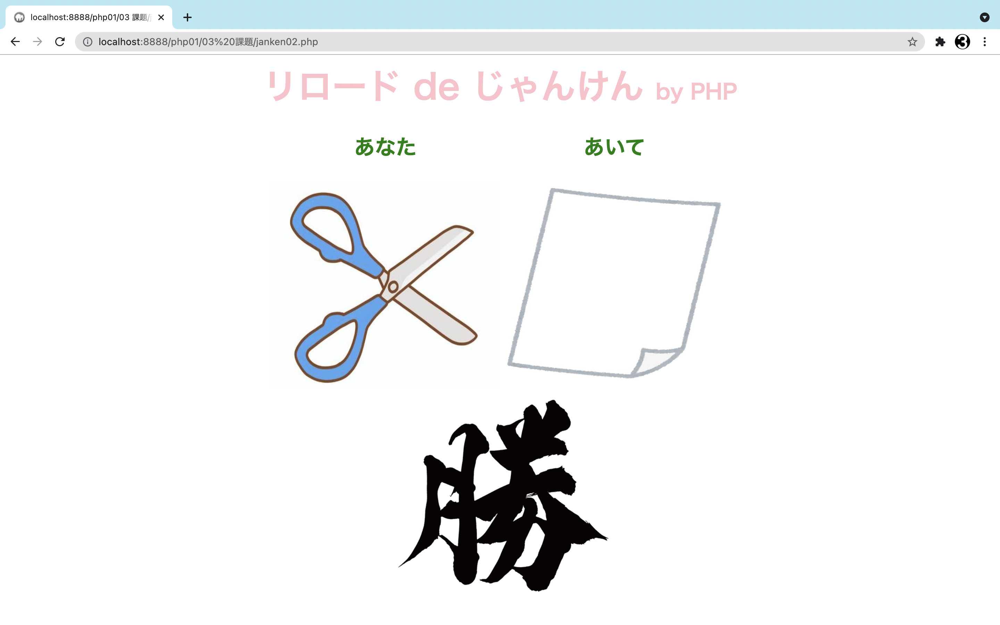
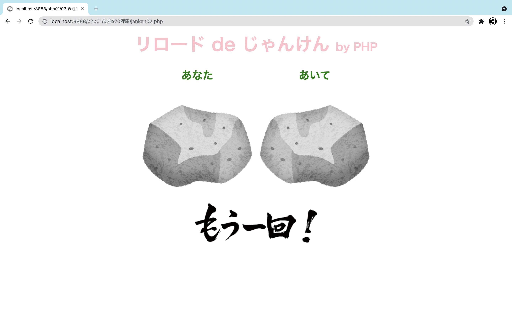
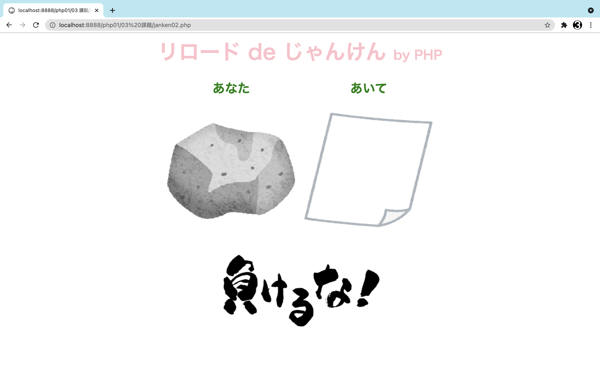

# 課題05：じゃんけんゲーム by PHP

## ①課題内容（どんな作品か）
- 石 × 鋏 × 紙 で勝負します。

## ②工夫した点・こだわった点
- かわいいイラスト(じゃんけんの手)と熱いテキスト(結果)の対比で、シュールさを表現しました。

  - 
  - 
  - 

## ③質問・疑問（あれば）
- 今回は、特にありません。

## ④その他（感想、シェアしたいことなんでも）
- じゃんけん作り２度目は、前回よりよく分かりました。
  - 前回と違う、シンプルな構造で作れました。
- 関数でコードを整理できたのが、嬉しかったです。
  - 見やすく、編集しやすくできました。
