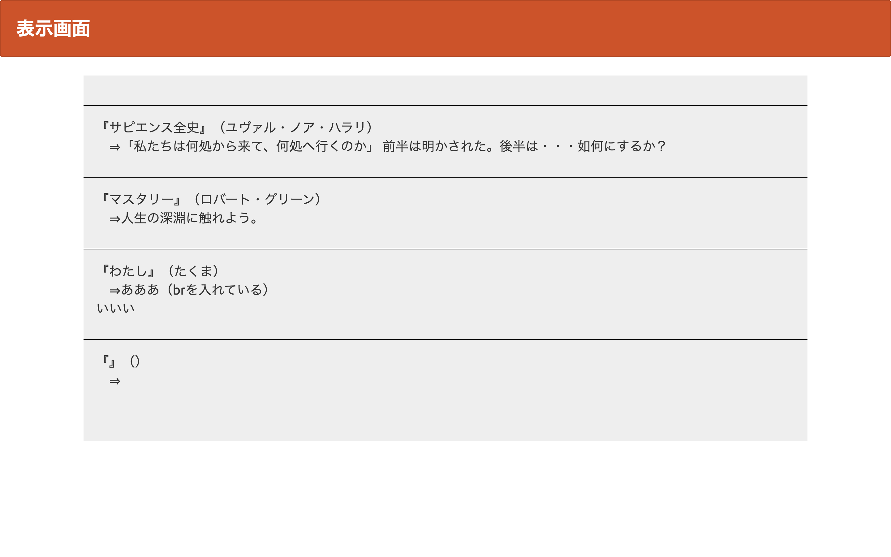

# 課題06：メモ帳アプリ by PHP

## ①課題内容（どんな作品か）
- 良かった本の書名・著者・一言感想を登録します。

## ②工夫した点・こだわった点
- 書名は『』、著者は（）の中に入れました。

## ③質問・疑問（あれば）
1. 表示画面(２ページ目)に入力画面(１ページ目)に戻るボタンを入れたかったが、どうしたらできたか？
    - 送信ボタンをクリックで何故２ページ目に飛ぶのか、コードから分からなかった。
2. 「insert.php」は、どのタイミングで機能しているのか？
3. 今回のデータ保存は、どこに保存されているのか？（ローカルのMAMP内？）
4. style(CSS)でmarginを指定しても反映されないことがあったが、 元から入っているCSSファイルの影響があったりするか？

## ④その他（感想、シェアしたいことなんでも）
- コードが難しくなってきました。
- 何ができるか＆作りたいものが、今回はあまり思い浮かびませんでした。
