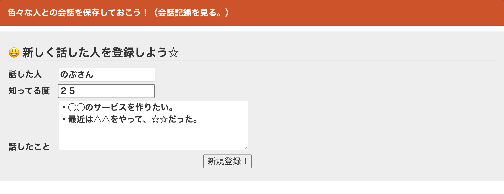
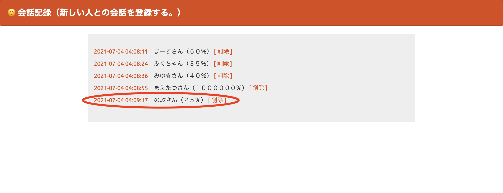
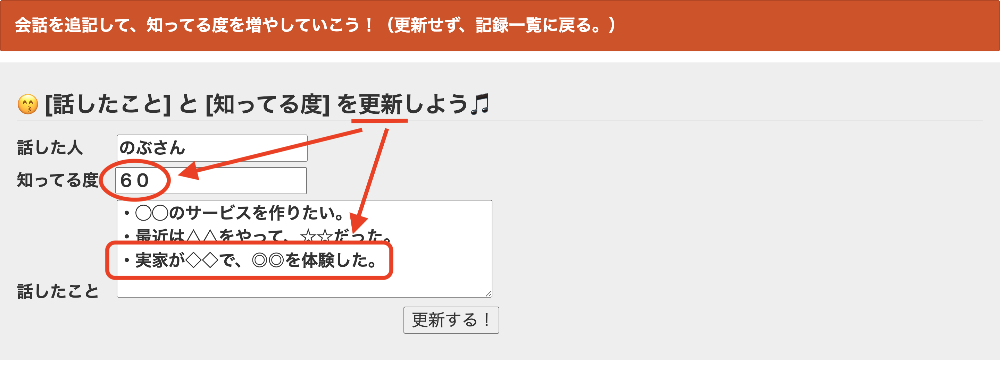
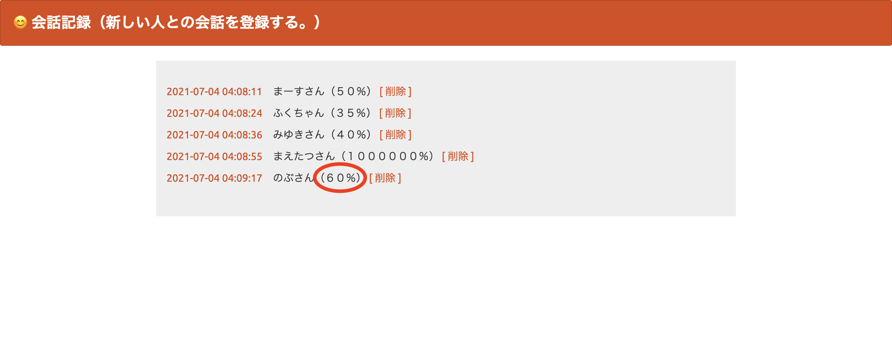
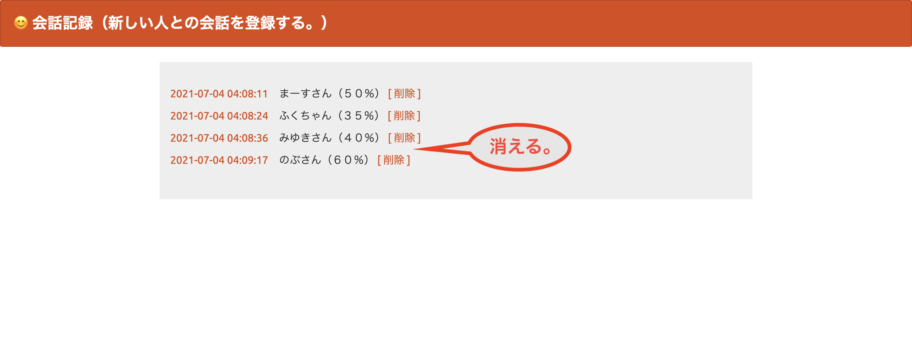

# 課題06：DB連携アプリ「会話記録」 by PHP

## ①課題内容（どんな作品か）
- 会話した人と内容を保存します。
- 相手の人をどれくらい知っているか、ざっくり％で記載します。
    - 低い人は上げましょう！
    - 100％を目指しましょう！笑

1. Create

2. Read

3. Update

4. Delete

## ②工夫した点・こだわった点
- 相手の理解度を可視化した点。（打つだけだが。。）

## ③質問・疑問（あれば）
1. Create(登録)とUpdate(更新)の画面やファイルを一つにできないか？
    - 分けるのが普通なのか？（コード構造をまだ理解できていない。）
2. index.phpの入力欄を減らしたら送信時にクエリエラー(?)が出たが、なぜか？ （よって、入力欄の増減に手が付かなかった。）

## ④その他（感想、シェアしたいことなんでも）
- PHPファイルの遷移関係が、ようやく分かりました。😅
