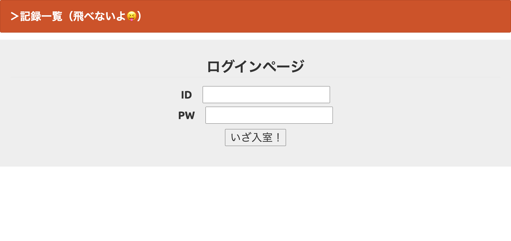
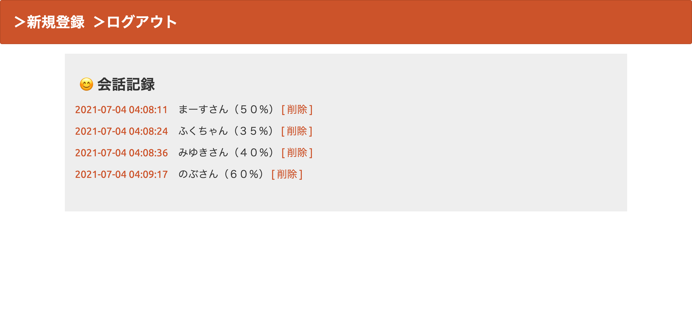
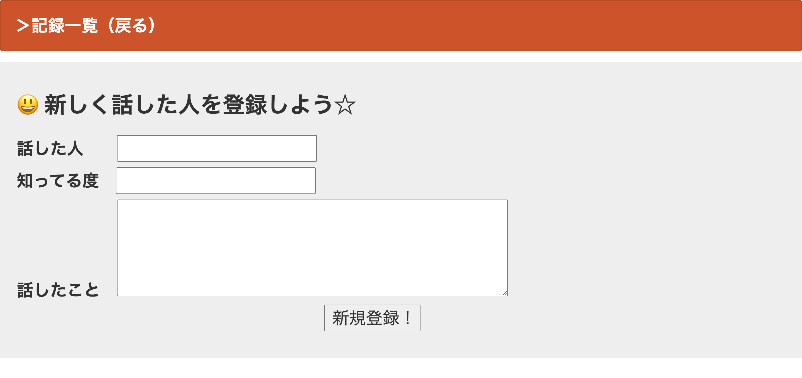
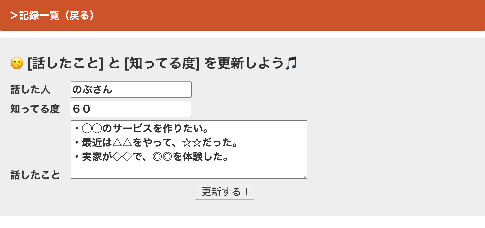

# 課題08：DB管理アプリ「会話記録 vol.2」 by PHP

## ①課題内容（どんな作品か）
- 前回提出分を更新しました。
    - ログイン／ログアウト機能を実装。
    - ヘッダーのテキスト等を修正。
- 【前回分】
    - 会話した人と内容を保存します。
    - 相手の人をどれくらい知っているか、ざっくり％で記載します。
        - 低い人は上げましょう！
        - 100％を目指しましょう！笑

1. LogIn

2. Read

3. Create

4. Update

## ②工夫した点・こだわった点
- フォントサイズの統一感。

## ③質問・疑問（あれば）
1. Create(登録)とUpdate(更新)の画面やファイルは、分けるのが普通なのか？ （１つにはしない／できないのか？）
    - それらを考えるためのコード構造をまだ理解できていない(と思われる)。
2. 【前回分】index.phpの入力欄を減らしたら送信時にクエリエラー(?)が出たが、なぜか？ （よって、入力欄の増減に手が付かなかった。）
3. 授業フォルダの中にあった「u_view.php」とは何か(何だったか)？

## ④その他（感想、シェアしたいことなんでも）
- ログアウトしてもログインできる状態だったので、 それを修正する際に `session_start();` の偉力を知りました。笑
